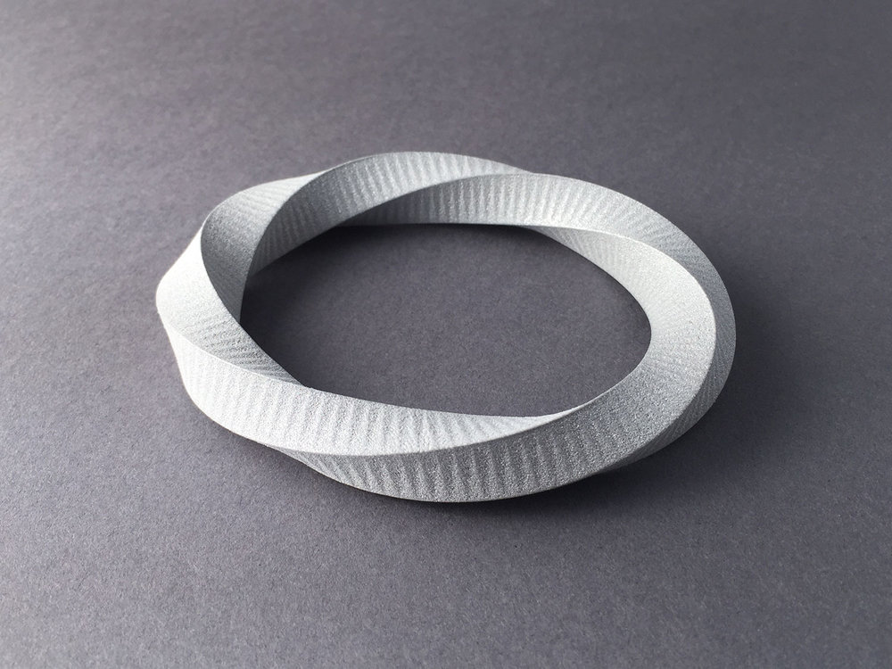

---
# to start:
# marp --html true -s .

marp: true
title: 'Data Mapping'
description: ''

theme: uncover

# title
_footer: 'ZHdK - IAD - Embodied Interaction'
_paginate: false

# content
footer: 'ZHdK - IAD - Embodied Interaction'
paginate: true

# video
style: |
  video.bg {
    position: absolute;
    left: 0;
    top: 0;
    right: 0;
    bottom: 0;
    width: 100%;
    height: 100%;
  }
  iframe.bg {
    position: absolute;
    left: 0;
    top: 0;
    z-index: -10;
    right: 0;
    bottom: 0;
    width: 100%;
    height: 100%;
  }
---

<!-- _color: black -->


## Data-Driven Modeling

* Data Mapping
* Algorithmic Modeling
* Procedural modeling

* > Using data to create forms.

---

### Today's Schedule

* Overview
* Data Processing 💻
* Models in 2d 📈
* Exercise 1 ⚡️
* Models in 3d 🍌
* (Exercise 2) ⚡️⚡️⚡️
* Your own project! 🕵🏼‍♀️

---

### Objectives

* How to process & map data
* Processing as Swiss Army Knife 🇨🇭🔪
* Repetition in Processing

---

### Questions?
👀

* Processing?
  * 😃🙌🏻
  * 🤔
  * 🥺🤷🏻‍♂️

---

### Terms


- Parametric design

---

### Terms


- Parametric design
- Generative design
* Data-Driven design

---


### Overview

* Data Mapping
  * Data Source
  * Process & Map
  * Data Target
* Aim
  * Simplify
  * Analyse
  * Extract 

---


---


### Embodied Interaction

* Pattern / Form
* Experience
* Map Data to Space

---

### Consuelo Keller


digimorphe.com

---

### 3D Print (PLA)


---

### 3D Print (Metal)


---



---


---

<video autoplay muted loop class="bg"><source src="images/scan3d-dramatic.mp4"></video>

---


---

### Deep Vision


* Master IAD
* 3D data as input

---

<div style="padding:56.25% 0 0 0;position:relative;"><iframe src="https://player.vimeo.com/video/346441587?color=867739&title=0&byline=0" style="position:absolute;top:0;left:0;width:100%;height:100%;" frameborder="0" allow="autoplay; fullscreen" allowfullscreen></iframe></div><script src="https://player.vimeo.com/api/player.js"></script>

---


---


---


---

### Demo Emil

🎪

---


---

### Demo Pointcloud

🎪

---


---

### Tools

* Rhino & Grasshopper
* Fusion360 Python
* Blender Node / Python
* Cinema4D Node / Python
* TinkerCAD Generator
* Processing

---

### Rhino Grasshopper


---

### Fusion360 Slicer


---

### Why Processing?

* Already in use
* Interaction
* Price
* Export
* Freedom / Programming

---

### Why not Processing?

* Freedom
* Programming
  * Especially 3D

<br />

* > Don't use it for everything!

---

### Questions?

---

### Pipeline

- Data Analysis 👀
- Data Pre-Processing 🍌
- Data Extraction 📈
- Model Generation 💻
- Model Export 
- Fabrication 🏭

---

### Data Example


* Github Contributions
* [github-contributions-api/cansik/count](https://github-contributions-api.herokuapp.com/cansik/count)

---


---

### Analysis

```json
{"data":{"2018":{"11":{"18":9,"19":8,"20":6,"21":22,"22":15,"23":5,"24":9,"25":15,"26":13,"27":12,"28":14,"29":2,"30":5},"12":{"1":0,"2":9,"3":17,"4":1,"5":1,"6":1,"7":1,"8":4,"9":8,"10":18,"11":13,"12":1,"13":3,"14":8,"15":1,"16":1,"17":10,"18":15,"19":4,"20":6,"21":1,"22":5,"23":9,"24":1,"25":6,"26":3,"27":5,"28":1,"29":1,"30":2,"31":1}},"2019":{"1":
```

* JSON / CSV
* [JSON Formatter](https://jsonformatter.curiousconcept.com/)

---

### Analysis


* Contribution count 🧮
* per day
* per month
* per year

---

### Data Input

* JSONLoader (JSON)
* Table (CSV)

<span style="font-size:50%">JSON: processing.org/reference/loadJSONObject_.html</span>
<span style="font-size:50%">CSV: processing.org/reference/loadTable_.html</span>

---

### Ideation

* 💡
* 💡💡
* 💡💡💡

---

### Idea 💎

> Create a bracelet that represents the work-balance of ones week.

* 🤷🏽‍♀️

---

### Data Processing 📈

* Filter
* Map
* Aggregation

---

### Filter


---

### Map


---

### Aggregation


---

### Bracelet Data Processing 💎

* Aggregation of contributions by weekday

---

### Aggregation 🧮

* Datastructure to store count by weekday
* Array / ArrayList
* `int[] weekdays = new int[7];`
* For Loops over Data


---

### Normalization

* Easy to use values later

```json
Monday:         421
Tuesday:	320
Wednesday:	292
Thursday:	203
Friday:	        210
Saturday:	150
Sunday:	        168
```

---

### Normalized Values

```
Monday:	        1.0
Tuesday:	0.64190984
Wednesday:	0.7798408
Thursday:	0.6392573
Friday:         0.52785146
Saturday:	0.3501326
Sunday:	        0.469496
```

---

### Normalize Function

```
void normalize(float[] data) {
  float max = max(data);
  for (int i = 0; i < data.length; i++) {
    data[i] /= max;
  }
}
```

---

### Output Desicion

* Define Output 2D / 3D
  * 2D -> `PDF` / `SVG`
  * 3D -> `OBJ`


---

### PDF Output (2d)

- Print
- Lasercut / CNC
- Project into space
- Manipulate in Illustrator

---

### Processing PDF Output

```processing
import processing.pdf.*;

PGraphics pdf = (PGraphicsPDF)beginRecord(PDF, pdfName);
pdf.setSize(round(px(width) * pixelDensity), 
            round(px(height)) * pixelDensity);
// draw
endRecord();
```

* Too complicated... 🙈

---

### PDF Utils

```processing
// brush settings
void cut();
void engrave();

// export
void createPDF(String pdfName);
```

https://git.io/JeK26

---

### Document Units (px)

* Create precise models
* `1 mm` = `0.3527778 px`

---

### PDF Utils

```processing
float mm(float px);
float px(float mm);
```

---

### Custom Shapes


```processing
beginShape();

vertex(0, 0);
vertex(20, 0);
vertex(20, 20);
vertex(0, 20);

curveVertex(84,  91);

endShape(CLOSE);
```

---

### Relief Data


* Too many data points
* Filter or aggregate points

---

### Bracelet Code

```processing
// inner
circle(0, 0, inner);

// outer
beginShape();
float angle = radians(360.0 / (weekdays.length));
float radius = (inner * 0.5) + thickness;

for (int i = 0; i < weekdays.length; i++) {
  // rotation, then translation
  float x = sin(angle * i) * (radius + (outer * weekdays[i]));
  float y = cos(angle * i) * (radius + (outer * weekdays[i]));

  vertex(x, y);
}
endShape(CLOSE);
```

---

### Parameters

* Use to create iterations
* You curate the outcomes
* Play around! 🤪

---

### ControlP5


* Control Parameters
* Contribution Manager

---

### ControlP5 Example

```processing
float test = 3.0;

ControlP5 cp5 = new ControlP5(this);

cp5.addSlider("test", 10, 150, 10, h, 100, 20)
    .setRange(1, 20)
    .setLabel("Test")
```

---

### Summary

* Data input (CSV / JSON)
* Data processing
  * (Filter / Map / Aggregation / Normalisation)
* 2D drawing
  * PShape
  * Metric Convertion
* Parameter
* PDF creation

---

### Demo App

🎪

---

### Demo App


---

### Task 1 ⚡️ <span style="font-size:50%">30min</span>

Either use your data or my provided one to create a basic sketch which creates 2D PDFs which are printable.

Use the provided sketch as an example! Think about data input / processing and parameters.

---

### Task 1 Hint

- Data Processing
- Data Visualisation
- 2D Model

---

### Questions?

---


### Processing 3d

- Same process as in 2d
- `X, Y, Z` ✨
- Camera 📷
- OBJ export
- Cleanup

---

### Sketch

- Set renderer to `P3D`

```processing
void setup() {
  size(500, 500, P3D);
}

void draw() {
  // do your 3d stuff
}
```

---

### 3D Coordinates

```processing
// position
rotateX(radians(30));
translate(250, 300, 0);

// draw object
box(100);
```

---


### Primitives

* `rect`
* `box`
* `sphere`
* `PShape` ✨

---

### Coordinate System

```
for(int i = 0; i < 100; i++) {
  push();

  // position
  translate(200, i);
  rotateX(radians(30 + i));

  // draw
  box(50);

  pop();
}
```

---

### Peasy Cam 📷

```processing
import peasy.PeasyCam;

PeasyCam cam;

void setup() {
  size(500, 500, P3D);
  
  cam = new PeasyCam(this, 400);
}
```

* Contribution Manager

---

### OBJ Export

* Works the same as PDF export
* Contribution Manager

```processing
createOBJ("github-bracelet.obj");
```

Utils: https://git.io/JeK26

---

### Post Processing

* Meshalb or MeshMixer
* Clean Model
  * Flip Normals
  * Scale
  * Remove Surfaces
* Create STL

---

### Meshlab


---

### Cetus3D


---

### 3D Summary

* Same Data Processing
* Coordinate System
* Camera
* Export to OBJ
* Cleanup

---

### Questions?