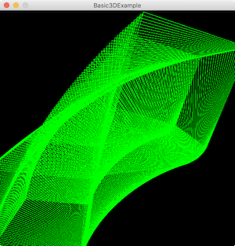
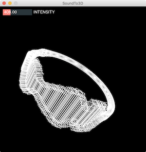

# Data Embodiment
Materials for the data embodiment input in the embodied interaction BA course.

### Structure

- Overview
- Data Mapping
- 2D in Processing
- 3D in Processing

### Examples

#### Github Visualisation

[Example](examples/GithubActivity)

#### Github Bracelet

[Example](examples/GithubActivityBracelet)

#### Basic 3D Sketch

[Example](examples/Basic3DExample)

#### Sound To 3D

[Example](examples/SoundTo3D)

### Utilities

- [PDF Utils](https://gist.github.com/cansik/fbb5ad05fca98831ea7a77a65c8f6e92#file-1pdfutils-pde)
- [OBJ Utils](https://gist.github.com/cansik/fbb5ad05fca98831ea7a77a65c8f6e92#file-2objutils-pde)

### Libraries

- [Peasycam](http://mrfeinberg.com/peasycam/)
- [ControlP5](http://www.sojamo.de/libraries/controlP5/)
